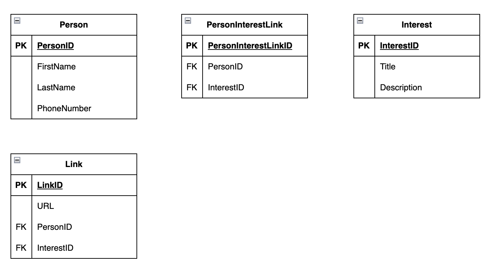
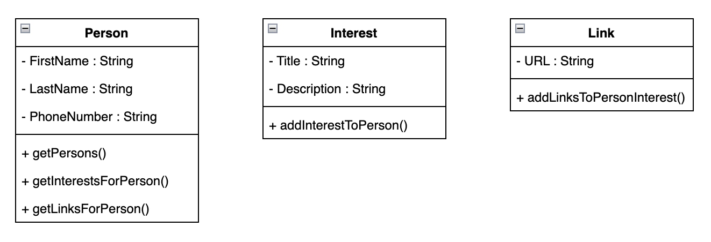

# Minimel API

## All the endpoints

- `GET https://localhost:7152/persons` - Returns all the persons
- `GET https://localhost:7152/persons/1/interests` - Returns all the interests of the person with id 1
- `GET https://localhost:7152/persons/1/links` - Returns all the links of the person with id 1
- `POST https://localhost:7152/persons/1/interests` - Adds an interest to the person with id 1
- `POST https://localhost:7152/persons/1/interests/1/links` - Adds links to the interest with id 1 of the person with id 1

### ER-diagram

### UML-diagram

